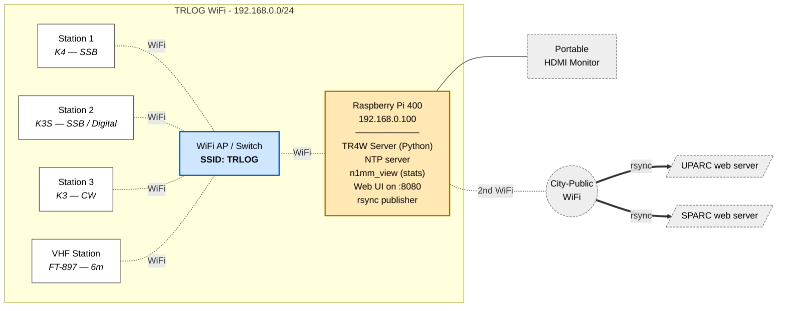

# Field Day Logging & Stats Network

Logical topology of the on-site logging and stats network for ARRL Field Day.

## Topology

**Legend:** dotted = WiFi · solid = HDMI · double arrow = rsync publish

---

## What runs on the Pi 400

The Pi 400 is now the *only* server. The previous Windows TR4W Server box
(`192.168.0.12`, wired Ethernet) is **gone**. Its functions have been
re-implemented as a Python script that runs on the Pi alongside the existing
stats workload.

**The TR4W Server and the n1mm_view stats stack are independent processes**
running on the same Pi. They share the host but not state — TR4W
coordination can fail while QSOs still reach the stats, or vice versa.
See [troubleshooting.md](troubleshooting.md) for the traffic flows.

| Service                | Purpose                                                    |
|------------------------|------------------------------------------------------------|
| TR4W Server (Python)   | Coordinates the four TR4W laptops (multi-op dup checks etc.) |
| NTP server             | Time sync source for all four laptops                      |
| **n1mm_view** (`~/n1mm_view`) | Receives UDP QSO broadcasts from the laptops; renders stats images (band / score / rate graphics) to a **RAM disk** on the Pi |
| **Local web server** `:8080`  | Serves the stats images on TRLOG — the HDMI monitor browses to it, and any laptop on TRLOG can view it too at `http://192.168.0.100:8080` |
| **rsync publisher**    | Whenever the RAM-disk images update, rsyncs them to the **UPARC** and **SPARC** web servers |

## Two WiFi interfaces — important

The Pi 400 is **dual-homed** by design. The two networks must not be confused:

| Interface          | SSID         | Purpose                                              |
|--------------------|--------------|------------------------------------------------------|
| Built-in WiFi      | **TRLOG**    | Talks to the logging laptops; static `192.168.0.100` |
| USB WiFi adapter   | **City-Public** | Internet uplink — for publishing stats *only*     |

## Laptop setup — non-negotiable

Each station's laptop **must** be configured to:

1. Connect **only to TRLOG** (set "connect automatically" on TRLOG).
2. Have **City-Public removed from saved networks** — especially personal laptops
   that may have joined it in past years.
3. Use the Pi 400 as its NTP source.

If a laptop silently auto-joins City-Public it leaves the TRLOG network,
TR4W coordination breaks for that station, and its QSOs stop reaching the
stats listener. This has bitten us in past years — verify on setup day.

## Changes from previous year

- **Removed:** Windows TR4W Server box (`192.168.0.12`, wired Ethernet to switch).
- **Added:** Python TR4W Server script on the Pi 400 — the Pi now performs
  *both* coordination and stats roles.
- **Station naming:** stations are now "Station 1 / 2 / 3 / VHF Station"
  (previously "TR4W Laptop VHF / 1 / 2 / 3").
- **Station 1 rig:** Elecraft K4 replaces the K3. Stays on SSB — the K4's CESSB
  feature gives 6–8 dB of effective talk power, so with only one K4 in the
  room it is more valuable on SSB than on CW.
- **VHF Station rig:** Yaesu FT-897 replaces the IC-7600 6m station.

---

See also: [troubleshooting.md](troubleshooting.md) for expected traffic and failure modes.
